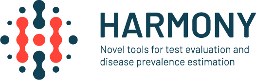

```{r rendering, eval=FALSE, include=FALSE}
# To render this as html:
rmarkdown::render('Session_Preparation.Rmd', 'html_document')
```

# Overview

This document will help you to prepare for the HARMONY training school on introduction to Bayesian Disease Measurement (BDM) for Health scientists being held in Larissa, Greece, 25 - 27 October 2022. 

The event is a training school, part of the HARMONY COST Action 18208 training activities, with introductory didactic teaching and hands-on practical sessions on Bayesian methods for prevalence estimation & diagnostic test evaluation, so it is important that you are using a computer with the necessary software installed..   

The following core topics will be covered:

1. Running basic models in JAGS
2. Apparent & true prevalence estimation
3. How to choose a prior distribution? 
4. Diagnostic test evaluation with Hui-Walter models

The purpose of this document is to ensure that you have the necessary software installed and access to the GitHub repository where the training material will be made available.

# Software installation

You need to install R (version 4.0.0 or later; preferably version 4.1.0) from https://cran.r-project.org/ and we recommend that you also use Rstudio which can be downloaded separately from https://www.rstudio.com/products/rstudio/download/

Please also install the latest versions of the following R packages from CRAN (or using the install.packages() function):  tidyverse, PriorGen, rjags, runjags, coda, TeachingDemos, ggmcmc

You will also need the standalone JAGS software (version 4.3.0 or later) for the course - download the installer for your platform from here:  https://sourceforge.net/projects/mcmc-jags/files/JAGS/4.x/

To check that you have installed the software correctly please run the following code within R (or RStudio) and make sure that no errors are produced:

```{r, results="hide", message=FALSE}
stopifnot(getRversion() >= "4.0.0")
stopifnot(require('tidyverse'))
stopifnot(require('PriorGen'))
stopifnot(require('rjags'))
stopifnot(require('runjags'))
stopifnot(require('coda'))
stopifnot(require('TeachingDemos'))
stopifnot(require('ggmcmc'))
stopifnot(testjags()$JAGS.available)
stopifnot(numeric_version(testjags()$JAGS.version) >= "4.3.0")
stopifnot(testjags()$rjags.found)
stopifnot(numeric_version(testjags()$rjags.version) >= "4-8")
```

If you have any difficulties installing the software or get errors from the code above, please let us know immediately so that we can resolve these during the summary of pre-course work session.

# Access to GitHub repository

We have created a public repository containing the training material for the training school.  This means that anyone can view the training material at any time via the following website: https://github.com/LefMel/HARMONY_BDM_Larissa.git

We will primarily be using GitHub as a way to disseminate the lecture notes and R/JAGS code for the exercises on course, so you only need to use the most basic features of GitHub.

GitHub is an online code repository that in it's most basic form stores the version history of any code project you are working on, and allows you to go back in time to a previous version before someone introduced a bug. It is particularly useful when collaborating with others because it allows you to see who made a change, when it was made, and what the code looked like before that. It also allows changes from different people to be merged into the same central repository to ensure that nobody gets out of sync with everybody else's code.

In the GitHub repository for this training school you'll see four folders with names "Pre_course_material, "Day_1_Material", "Day_2_Material" and "Day_3_Material". 
Within these folders you'll find the presentations in pdf format and the R/JAGS scripts.

We haven't uploaded all the material for days 1, 2, 3, so make sure that you download all the content of the GitHub repository one day before the event.
To download the content of the GitHub repository open the link (https://github.com/LefMel/HARMONY_BDM_Larissa.git) click on "Code" and then download ZIP.

# Conclusion 

The training school is conducted in the context of COST Action 18208:
  
CA18208 - **[HARMONY](https://harmony-net.eu/)** Novel tools for test evaluation and disease prevalence estimation

{width=3in}  

